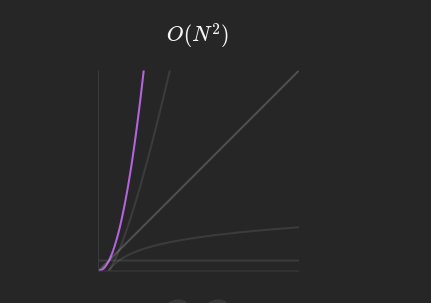

# Intuition
- Loop and calculate 

# Approach
- Step 1: check is sub array contains digit from `1` to `9`
- Step 2: Sum by diagonals first
- Step 3: Sum by row and col

# Complexity
- Time complexity:




# Code
```java
class Solution {
   private static boolean isInRange(int num) {
            return num <= 0 || num >= 10;
        }

        private static boolean isMagic(int[][] arr, int xIdx, int yIdx) {

            // check contain from 1 to 9
            byte[] flags = {0, 0, 0, 0, 0, 0, 0, 0, 0};
            for (int i = xIdx; i < xIdx + 3; i++) {
                for (int j = yIdx; j < yIdx + 3; j++) {
                    int temp = arr[i][j];
                    if (isInRange(temp)) {
                        return false;
                    }
                    if (flags[temp - 1] == 1) {
                        return false;
                    }
                    flags[temp - 1] = 1;
                }
            }
            // check sum diagonals
            int sum1 = 0, sum2 = 0;
            for (int i = 0; i < 3; i++) {
                sum1 += arr[xIdx + i][yIdx + i];
                sum2 += arr[xIdx + i][(yIdx + 3) - i - 1];
            }

            if (sum1 != sum2) {
                return false;
            }

            for (int i=0; i< 3; i++) {
                int temp = arr[xIdx + i][yIdx] + arr[xIdx + i][yIdx + 1] + arr[xIdx + i][yIdx + 2];
                int tempY = arr[xIdx][yIdx+i] + arr[xIdx + 1][yIdx + i] + arr[xIdx+2][yIdx + i];
                if (temp != sum1 || tempY != sum1) {
                    return false;
                }
            }
            return true;
        }

        public static int numMagicSquaresInside(int[][] arr) {
            int count = 0;
            int rows = arr.length;
            int cols = arr[0].length;
            for (int i = 0; i <= rows - 3; i++) {
                for (int j = 0; j <= cols - 3; j++) {
                    if (isMagic(arr, i, j)) {
                        count++;
                    }
                }
            }

            return count;
        }
    }
```